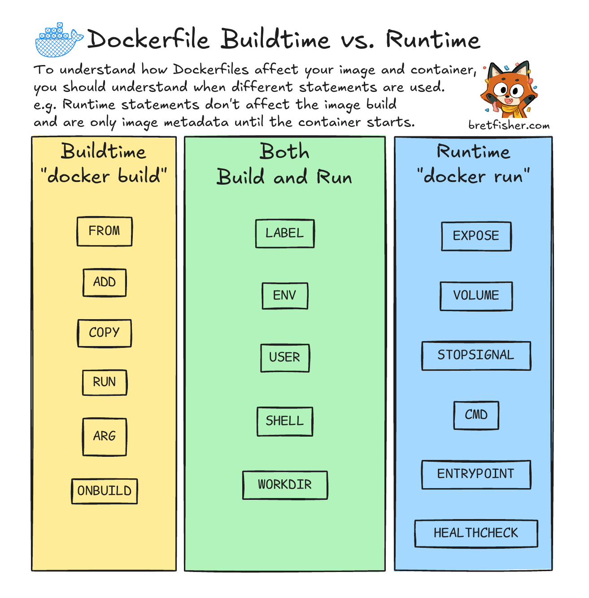
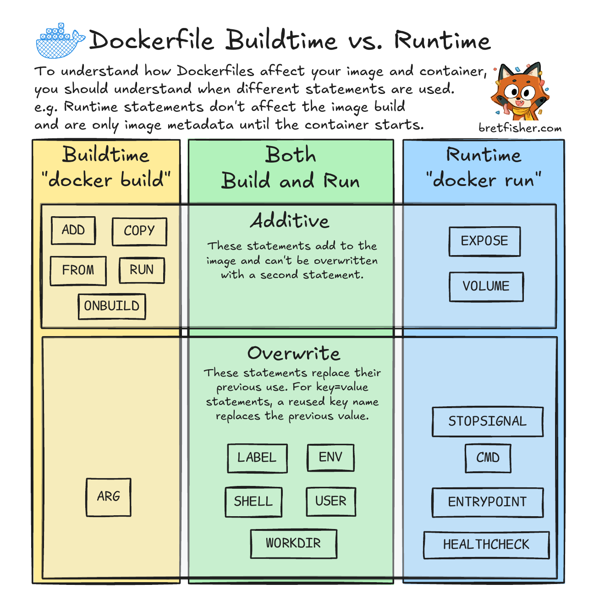

# Section 7

## Intro: Review before ENTRYPOINT
```Dockerfile
FROM python:slim
ENV PYTHONUNBUFFERED=1
WORKDIR /app
COPY requriements.txt .
RUN pip install -r requirements.txt
COPY . .
EXPOSE 8000
CMD ["python", "main.py"]
```
- there is 20 dockerfile commands available

## Buildtime vs. Runtime
- `CMD` is a runtime statement, it is only used when starting a container. commands like `COPY` and `RUN` are Buildtime statements. `ENV` is both runtime and buildtime.
- There can only be one `WORKDIR` and `CMD`, the last one will overwrite the one before. `EXPOSE` is additive and there can be many additional ports opened.




## What's an Entrypoint?
- Very similar to `CMD`. Is a runtime statement there can only be one `ENTRYPOINT`
- you can use `docker inspect busybox` to see how the dockerfile statements are defined in the image
- For containers that are using `sh` commands, you need to run them with the `-it` flag to keep the container running in an interactive shell.
- `CMD` statements in a dockerfile can be overruled when providing a command in the `docker run _container_ date` (date would be the overwriting cmd statement here). `ENTRYPOINT` however is much more difficult to overwrite.
- if just trying to create a simple command when starting the container, always use `CMD`, `ENTRYPOINT` is supposed to be use in conjuntion with `CMD` 

## Using ENTRYPOINT an CMD together
- When you have both the `ENTRYPOINT` and `CMD` defined together, you get a returned `ENTRYPOINT CMD` command out (space inbetween the two).
- You can use this for two reasons: Use the docker container as a comand line tool or you want to run a startup scirpt before the container starts.
- You can see the first use case in my example here: `Docker-Certification/assignments/dockerfiles/entrypoint-cmd-1/Dockerfile`. This allows the container to act almost like a script where all you have to do is provide an argument and then the script runs (also has a default `--help` is the user forgets to put CMD argument).
- Second use is for a script. You want the `CMD` the run the application directly (postgres, Node, Python). 
    - if you use a `startup.sh` upon start with a `CMD`, this becomes the main process and then the app itself becomes a subprocess. This makes so that when docker tries to gracefully stop or shutdown the container, docker is forced to kill the container (delays and can break data).
    - To make this work correctly: put `startup.sh` in the `ENTRYPOINT` and then at the end of `startup.sh` put `exec "$@"`. This starts the application set in CMD.
- Many databases use this script combination. For example postgres has an `ENTRYPOINT=docker-entrypoint.sh` script and then a `CMD=mysqld`. At the end of the `docker-entrypoint.sh` which contains admin config setup is the `exec "$@"`. 

## Shell vs Exec Form
- Exec form: `CMD ["python", "server,py"]`
- Shell form: `RUN apt-get update && apt get upgrade -y`
- you can use the `SHELL` statement, EX : `SHELL /bin/bash`. This is commonly used in windows container where the shell will default to cmd.exe which doesn't have all of the same features like ssh.
- if you use exec form you cannot using piping by default, or `&&` (chaining commands) or some enviorment features.
- When using `RUN`, almost always use shell by default.
- When using `ENTRYPOINT`, always use Exec form otherwise `CMD` cannot be used.
- When using `CMD` use Exec by default but sometimes shell when
    - you are not using ENTRYPOINT and need the features of having sh (variable substitution, chaining commands).
    - When using `CMD` and `ENTRYPOINT`, always use exec form.
- exec form runs command as PID 1 whereas shell form does a `/bin/bash -c (PID 1) | ->your command`.
- In Exec form, all earlier set `ENV` statements can be accessed in `CMD`.

## Assignment: Create CLI Utilities


